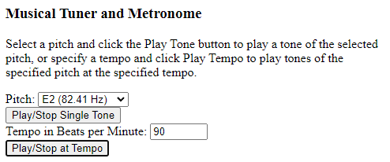

MusicalKeyboardInstrument
=========================

A simple musical keyboard instrument in JavaScript using AudioContext.

Despite the name, as of this writing only mouse controls are supported.

